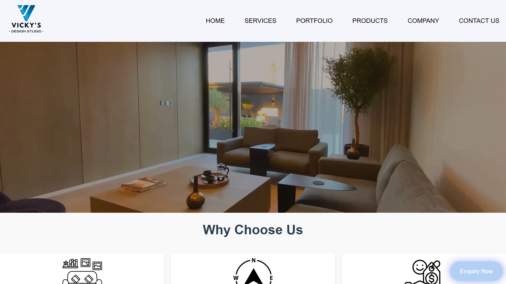
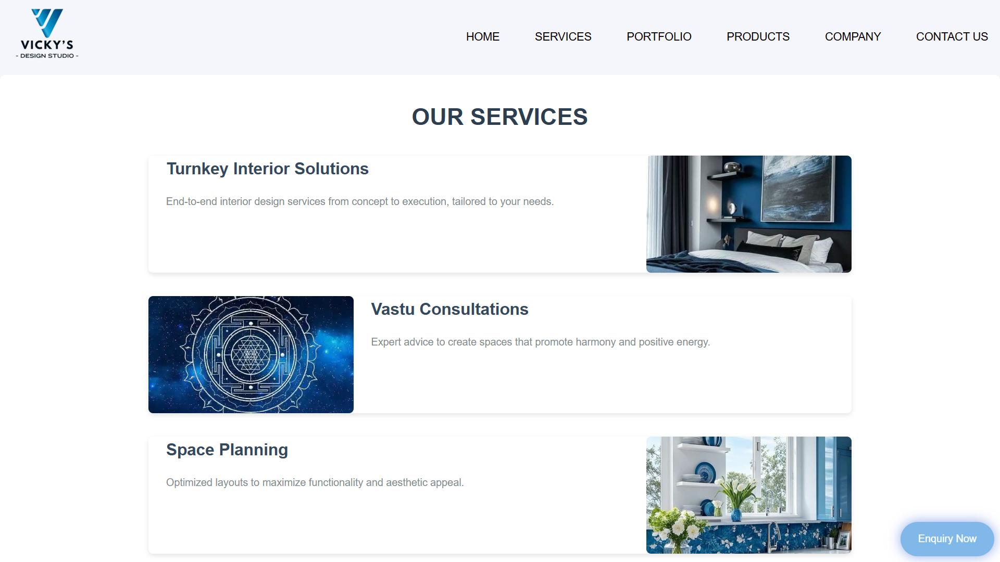
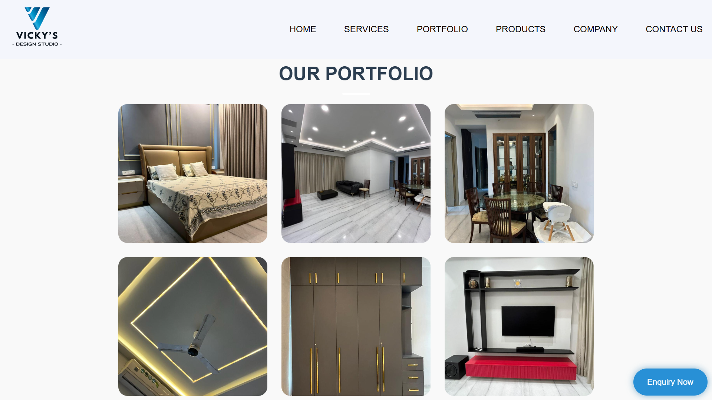
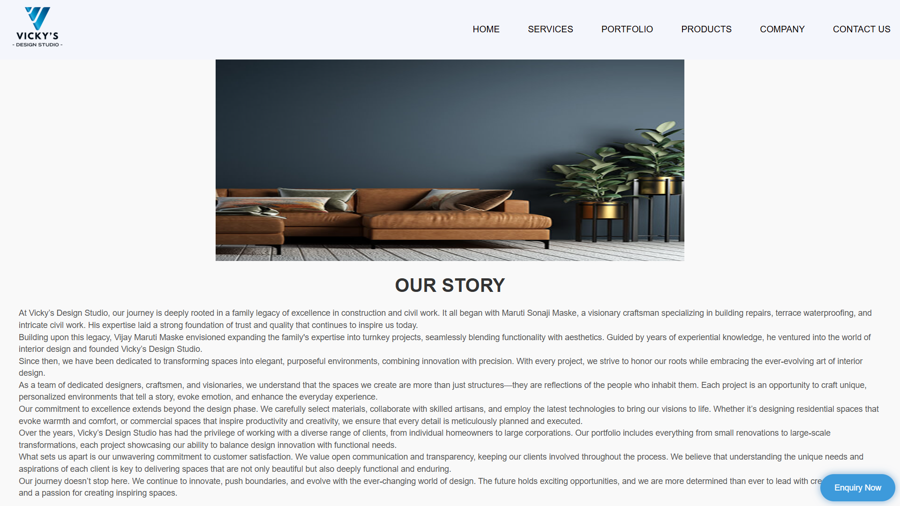

# Interior Design & Construction Website
&nbsp;&nbsp;
## 🌐 Live Demo  

<a href="https://construction-websit.netlify.app/" target="_blank">
  
</a>

<a href="https://github.com/Mdyadav49/Construction_Website/tree/main" target="_blank">
  
</a>


&nbsp;

---

## 📌 About

A modern and responsive website for an interior design & construction company based in **Mumbai, India**.

Built using **HTML, CSS, and JavaScript** with focus on performance, UI, and simplicity.

---

## 📸 Preview

| Home                                                       | Services                                                           |
| ---------------------------------------------------------- | ------------------------------------------------------------------ |
|  |  |

| Portfolio                                                            | About                                                        |
| -------------------------------------------------------------------- | ------------------------------------------------------------ |
|  |  |

---

## ✨ Features

* 🎥 Video Hero Section
* 📱 Fully Responsive Design
* 🎨 Smooth Animations
* 🖼️ Portfolio Gallery
* 📩 Contact Form
* 📌 Sticky Navigation

---

## Project Structure

```
construction_website/
├── 📄 index.html          # Homepage with video banner
├── 📄 services.html      # Services offered
├── 📄 portfolio.html     # Project portfolio gallery
├── 📄 our-products.html  # Furniture & product showcase
├── 📄 about-us.html       # Company story & history
├── 📄 careers.html        # Job opportunities
├── 📄 contact-us.html     # Contact information
├── 🎨 style.css          # Main stylesheet
├── ⚙️ index.js            # JavaScript functionality
├── 📁 img/                # Images and media
│   └── cliparts .jpg/     # Logo, portfolio images, video
└── 📄 README.md           # This file
```


---

## 🛠️ Tech Stack  

<p align="center">
  
  
  
</p>

---

## ⚙️ Run Locally

```bash
git clone https://github.com/Mdyadav49/Construction_Website
cd construction_website
open index.html
```

---

## Contact

### 📍 Location

**Vicky's Design Studio**  
SG Barve Marg, Netaji Nagar,  
Brahmanwadi, Kurla,  
Mumbai, Maharashtra 400024

### 📱 Get in Touch

| Contact Method | Details |
|----------------|---------|
| **Phone** | +91-9833924169 |
| **Email** | Vijaynmumbai@gmail.com |

---

<p align="center">Made with ❤️ </p>


